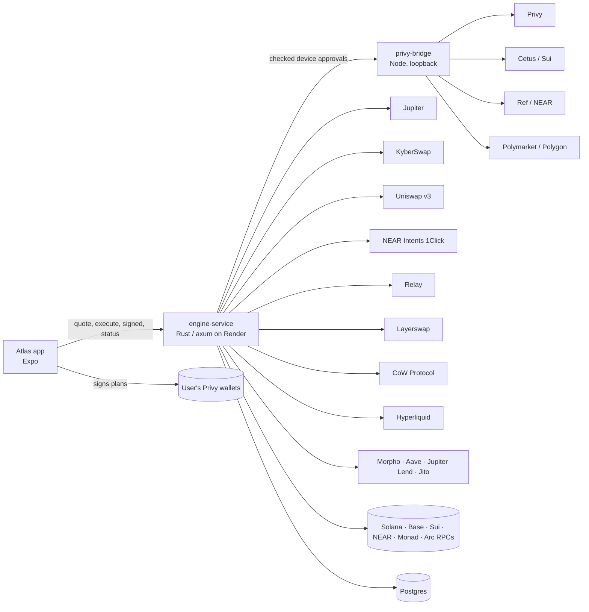

# Atlas Engine

**One balance, every chain, one tap.** Atlas gives people in Nigeria (and anywhere they're paid in a
currency that loses value) one balance in their own money that can buy memes, tokenized stocks and crypto,
open perps, trade predictions, earn yield and pay friends, across Solana, Base, Sui, Monad, NEAR and Arc. This repo is the
engine behind the [Atlas app](https://github.com/Iwetan77/Atlas): it prices everything, plans every action
as bounded transactions and device signatures for the user's **own** wallets, and settles them.

- **API and website:** https://justatlas.xyz (`GET /health` shows the deployed commit and RPC hosts)
- **App:** [Iwetan77/Atlas](https://github.com/Iwetan77/Atlas) (Expo: iOS, Android, web)

Money is always shown in the user's currency (₦ first). Under the hood the cash is USDC on Solana and Base.
Chain names only appear where they protect the user: the deposit screen, where sending on the wrong
network loses money.

---

## How it works

1. **Sign in** with Google or email. Privy creates an embedded EVM wallet and a Solana wallet the user owns;
   the engine adds Sui and NEAR receiving wallets under the same login the first time they're needed.
2. **Add money.**
   - USDC on Solana or Base goes straight into the user's own wallet.
   - 23 more options (USDT on Tron and BNB Chain, USDC on Sui, SOL, BTC, ETH…) get a one-off deposit address
     from NEAR Intents 1Click; the quote fixes the USDC output on Solana. Type what should land in the balance;
     fees are added on top, and the app shows the total to send. The most used are flagged `featured`.
   - Bank top-ups create a one-time Nigerian bank account. The requested balance amount is preserved;
     Fee and delivery charges go on top of the transfer total.
3. **One balance.** `GET /v1/balance` adds up cash on every chain, savings, perps margin and every coin held,
   valued live in the user's currency.
4. **Every action is a quote, then one confirm.**
   - The app asks for a quote; the engine prices it and checks limits and cash, in the user's currency.
   - On confirm it returns an **execution plan**: the exact transactions for the user's wallets, in order.
   - The app signs transactions, checked typed data and one-use device approvals after the one confirmation;
     the engine lands them and reports each stage:
     `validate → fund → sign → execute → settle`.
5. **Unified cash.** If the cash is on the other chain, the plan moves the shortfall first and finishes
   the action once it lands, still behind that one confirm:
   - Base → Solana through **Relay** (seconds, about 3 cents, no Base gas);
   - Solana → Base through **Layerswap** (with ETH for gas on the way when the wallet has none);
   - perps margin into **Hyperliquid** through Relay (gasless from Base, or one Solana transaction).
6. **Gas is never Atlas's.** The user pays from their own USDC, and Privy sponsorship is never used:
   - Solana swaps simulate the user's own transaction first, including fees and account rent.
     If it can pay, Jupiter V2 `/build` is used with no gasless minimum. Otherwise an executable
     Jupiter gasless order is tried. If neither works, cash buys a fee reserve through **Kora +
     NEAR Intents 1Click**, described below. Atlas never funds a fee-payer wallet.
     Plans remain plain transactions (`submit: "engine"`); the phone signs, the engine verifies
     the exact message and signatures, and settlement reads actual on-chain balance changes.
   - Base: USDC leaving Base needs no ETH (one signed authorization; the venue's relayer pays). A wallet with
     no ETH first fills its tank with a gasless **CoW** order ($0.50 USDC → ETH, ~$0.004). With neither, the
     user is asked to add about $0.50.
7. **Atlas Links.** Money anyone can claim with a link. The sender's phone makes the link's secret (an EVM
   key) and only its escrow address reaches the engine; the plan funds the escrow on Base. The friend opens
   the link, signs in, and the bridge (given the secret they hold) signs one payout through Relay to their
   Solana wallet, with no gas. The sender can take it back the same way; after 30 days only the sender can.
8. **Track records.** Every spot fill is kept, so each holding shows its average entry and gain or loss;
   meme cards on Home are made from it. Activity includes deposits, sends, withdrawals, trades and predictions,
   with pending states and transaction IDs. Home shows six recent actions and links to the full history.
   Bank recipient suggestions filter saved recents as the user types an account number.
9. **Predictions.** Polymarket events and outcome shares, paid from the balance. The user's device signs
   and submits venue requests; cash returned to Atlas lands the amount entered, with fees added on top.
10. **Money emails.** Senviok sends event updates to the user's sign-in address, with an opt-out in Profile.

---

## What's integrated

| | What it does in Atlas |
|---|---|
| **Privy** | Sign-in and user-owned wallets. The phone signs transactions, typed data and exact one-use device approvals. The bridge passes approvals to Privy and verifies signatures; it never signs using a user's JWT or an unrestricted server key. |
| **Jupiter** | Solana spot: ~350 verified assets (memes, xStocks, crypto), gasless orders, price charts, Jupiter Lend savings. |
| **KyberSwap** | Base swaps: searches every exchange for the best route (router pinned, every built swap decoded and checked: amount in, no fees, pays the user). Any Base token by pasting its address; trending Base coins (GeckoTerminal, CoinGecko-listed only) in Trade. |
| **Uniswap v3** | Base swaps when Kyber can't answer (one direct pool). |
| **NEAR Intents 1Click** | Buys on other chains (Sui, NEAR, Monad…), paid from Base cash or, when Base can't cover it, Solana cash; deposits from supported networks and coins; listed-asset sells and SUI cashouts. |
| **Cetus** | Sui coins 1Click doesn't list (DEEP, WAL…): 1Click delivers SUI, then a device-approved Cetus swap buys the coin. Selling swaps back to SUI before cash-out. |
| **Ref Finance** | NEAR tokens beyond 1Click's list: search, holdings and swaps through Ref pools, signed with one-use device approvals. Pool discovery depends on Ref's indexer. |
| **Polymarket** | Live events, outcome-share buy/sell, resolved claims and exact-output cash return; the phone signs and submits authentication, orders and wallet actions. |
| **Kora** | User-paid USDC transfers for the Solana gas-reserve fallback; Atlas does not sponsor gas. |
| **Bank transfers** | One-time Nigerian bank accounts for top-ups and Nigerian bank payouts; the user sees Fee and Rate. |
| **Relay** | Base → Solana cash moves (one EIP-3009 signature, the solver pays gas), and Atlas Link payouts. |
| **Layerswap** | Solana → Base (with refuel), the fallback to Relay. |
| **CoW Protocol** | The Base gas tank: a USDC permit plus a USDC → ETH order, settled by a solver who pays the gas. |
| **Hyperliquid** | Perps: ~290 markets (its own crypto perps plus the `xyz` dex's stocks, commodities, indices and currencies), margin moved in from the balance by Relay in the same confirm, open/close with one confirm, money back to cash after a close, take-profit and stop-loss on the whole position (set when opening or later, as a gain or loss on margin), candles for charts. The account is the user's own wallet; trades are signed by a per-user agent the user approves once (it can trade, never withdraw). |
| **Morpho, Aave, Jupiter Lend, Jito** | Earn: Morpho's three largest curated USDC vaults on Base (Gauntlet, Spark, Steakhouse), Aave USDC on Base, Jupiter Lend (USDC, USDT, JupUSD, USDS, EURC), SOL staking. Best rate first. |
| **GeckoTerminal, CoinGecko, DexScreener** | Charts for coins beyond Jupiter; the CoinGecko listing that marks a searched coin verified (exact contract, per chain); Sui search. |
| **Senviok** | Emails from "Ebube from Atlas" (hello@justatlas.xyz): money in (bank top-ups, deposits, a friend paying you), money out (cash-outs paid, sends, links, withdrawals), trades and predictions, and perps alerts (liquidation, take-profit or stop-loss hit, close to liquidation). Once per event, to the sign-in email, off in Profile. |
| **Helius** | Solana RPC in production (any keyed RPC works). |
| **Render + Postgres** | Hosting; intents, trades, handles and photos survive restarts. |

---

## Safety model

Atlas never holds user funds, and the engine can't move a user's money anywhere they didn't confirm.

- **The user signs.** After one confirmation, the device signs bounded transactions, typed data and
  exact Privy authorization requests. Sui and NEAR requests are prepared once, expire within minutes,
  and can be committed only once. The bridge verifies the owner and confirmed bounds before forwarding
  the device's approval to Privy; no `user_jwts` wallet-signing path remains.
- **Every signed shape stays narrow** (`privy-bridge/base-authorization.mjs`):
  - a USDC `ReceiveWithAuthorization` from the user's wallet to a **pinned** receiver (Relay),
    for exactly the planned amount;
  - a USDC permit to CoW's vault relayer and a CoW order selling USDC for ETH **to the wallet itself**,
    both capped at $2 and two hours;
  - for an Atlas Link, a payout from the link's own escrow to Relay's pinned receiver, signed with the
    secret the claimer holds (the engine never stores it).
- **Venue answers are checked before anything is planned:** deposit contracts, receivers, amounts, chain IDs
  and minimum outputs. A quote that differs from what the user saw is refused.
- **Exact approvals**, never unlimited ones.
- **Retries never double an action.** Intents are claimed once (Postgres), stages only move forward, and a
  repeated report returns the current status.
- **Perps orders** are signed by the user's Hyperliquid agent: derived per user, approved once by the user's
  own wallet inside their first trade's confirm, able to trade and move margin between the user's own
  balances (Hyperliquid's own perps and the `xyz` stock dex), never withdraw or pay anyone else.
- **Perps money back to cash** after a close: the bridge asks Relay for the quote itself, with the user's own
  Solana (or Base) wallet as the recipient, checks every field of the two things the user's wallet signs (Relay's
  nonce mapping, a USDC `sendAsset` of exactly that amount to Relay's Hyperliquid account) and recovers the signer.
- **Unverified coins say so.** A coin found by search is verified only when CoinGecko lists that exact
  contract on its chain; look-alikes keep the warning.
- **Errors are honest:** in the user's currency, and when nothing moved, they say nothing moved.

---

## Architecture



```
crates/engine-service      The HTTP API: balance, markets, trades, perps, earn, friends, deposits, intents.
  src/markets.rs           Catalog, quotes, plans, unified cash, gas tanks, intent state machine.
  src/near_intents.rs      1Click buys, deposits, Sui/NEAR/Monad holdings, charts and verification.
  src/earn.rs              Morpho, Aave, Jupiter Lend, Jito.
  src/hl.rs                Hyperliquid perps: markets, positions, quotes, margin, orders, cash-out.
  src/gasless.rs           Prepares checked device typed-data authorizations and verifies the result.
  privy-bridge/            Node sidecar: token checks, one-use device approvals, signature verification.
crates/engine-execution    Venue clients: jupiter, uniswap, near_intents, relay_link, layerswap, cow,
                           hyperliquid, solana, gateway.
crates/engine-core, engine-types, engine-discovery   Shared types and routing primitives.
```

**The engine in one breath:** a quote prices the action and checks cash across chains; execute turns it into
an intent with a plan (and, when cash or gas must move first, a funding step); `/signed` lands or relays what
the user signed; the status poll walks the intent through its stages, handing out the second step
(`/next`) once cash or gas has landed; fills are kept as trades for positions.

---

## API

Account and money-action routes need `Authorization: Bearer <Privy access token>`. Public exceptions
include `/health`, cash-link previews, Predictions availability and the served website. Money in and
out is in the user's display currency.

| Method | Route | Purpose |
|---|---|---|
| GET | `/health` | Liveness, deployed commit, RPC hosts |
| GET | `/v1/balance?currency=` | The one balance and its holdings |
| GET | `/v1/assets?category=popular\|crypto\|stocks\|memes&q=` | Trade list (popular = trending) and search, incl. pasted addresses |
| GET | `/v1/assets/{id}/chart?range=1D\|1W\|1M\|1Y` | Price history (spot, 1Click coins and `*-PERP` markets) |
| POST | `/v1/quotes` → `/v1/quotes/{id}/execute` | Buy/sell quote, then its plan |
| GET | `/v1/positions/spot` | Entry, invested, value and gain/loss per holding |
| POST | `/v1/intents/{id}/signed` | What the app signed or sent for a plan |
| GET | `/v1/intents/{id}` | Where an intent stands |
| GET | `/v1/intents/{id}/next` | The second step, once cash or gas has landed |
| GET | `/v1/intents/pending` | Purchases awaiting a device signature or recoverable completion |
| GET | `/v1/transactions` · `/v1/transactions/{id}` | Activity history, receipts and transaction IDs |
| POST | `/v1/onramp/bank/quote` · `/v1/onramp/bank` | Exact balance amount and the fee-inclusive bank transfer total |
| GET | `/v1/onramp/bank/{id}` | Bank top-up status |
| GET | `/v1/predictions/markets` · `/v1/predictions/account` | Events, outcome shares and Predictions cash |
| POST | `/v1/predictions/quotes` → `/v1/predictions/quotes/{id}/execute` | Buy, sell, claim or return cash with one confirmation |
| GET/POST | `/v1/perps/onboarding` | Perps access for the user's wallet |
| GET | `/v1/perps/markets`, `/v1/perps/positions` | Hyperliquid markets (crypto, stocks, commodities, indices, currencies) and open positions |
| POST | `/v1/perps/quotes` → `/execute`, `/v1/perps/positions/{id}/close-quote` → `/v1/perps/close-quotes/{id}/execute` | Open (optionally with `takeProfitPct` / `stopLossPct`, a gain or loss on margin) and close |
| POST | `/v1/perps/positions/{id}/tpsl` `{takeProfitPct, stopLossPct}` | Set or clear (null) a position's take-profit and stop-loss; positions carry `takeProfit` / `stopLoss` `{price, pct}` |
| GET · POST | `/v1/me/emails` · `{enabled}` | Where Atlas emails the user, and turning those emails on or off |
| GET | `/v1/earn/options`, `/v1/earn/positions` | Savings options and what's earning |
| POST | `/v1/earn/quotes` → `/v1/earn/quotes/{id}/execute` | Put in / take out |
| GET/POST | `/v1/me`, `/v1/me/handle`, `/v1/me/avatar`, `/v1/users/resolve` | Profile, @handles, photos |
| GET · POST | `/v1/cashlinks/{escrow}` (public) · `/v1/cashlinks/{escrow}/claim` | An Atlas Link, and claiming it |
| POST | `/v1/sends/quote` → `/v1/sends/quote/{id}/execute` | Send to a friend |
| GET | `/v1/deposit/networks` · POST `/v1/deposit/quote` · GET `/v1/deposit/status` | Deposits from other networks |
| GET · POST | `/v1/predictions/markets/{id}/comments` · POST `/v1/predictions/comments/{id}/delete` | A market's comments (newest first, 30 a page) signed with @handles; posting needs a handle, one line up to 280 characters, no links, one every 15 seconds and 30 an hour; only your own can be deleted |
| GET | `/v1/withdrawals/networks` · POST `/v1/withdrawals/quote` → `/v1/withdrawals/quote/{id}/execute` | Withdraw to a wallet: cash leaves as USDC on Solana or Base, or any deposit coin, sent by 1Click to a pasted address; the amount entered is what the recipient gets, and fees go on top |

Deposits from a wallet/exchange and bank top-ups use the entered amount as the target balance credit.
Their quotes show the extra route/delivery fees and the full amount to send. Predictions cash return
also uses exact output: the quote's receive value is the entered amount and the debit includes fees.
Availability and minimums are checked against the live provider; no quote promises an unavailable route.

A deposit does not itself collect a Solana gas reserve on every arrival. Ordinary swaps first inspect
existing SOL and simulate the unsigned transaction, including account rent; top-ups are conditional.
The gas tank is kept outside spendable cash and valued at live SOL/USD and currency exchange rates,
so its naira value can change even when the SOL quantity stays the same. Compare `gas[].amount`
and the on-chain transfer to establish whether SOL was actually added.

Wallet withdrawals use an exact-output quote. POST /v1/withdrawals/quote takes
{ networkId, address, amount: { amount, currency } }, where amount is the recipient's payout value.
The response keeps the same shape: receive.value is that entered value, receive.amount is the fixed
coin amount, send is the full cash debit, and fee is send minus the payout (1Click app/route costs
and its input price buffer). The input buffer can be refunded after settlement. networkFee separately
estimates the wallet transfer's native-coin cost. The review and confirmation show the payout, fee
and total cash debit; execution refuses a higher debit or a smaller coin payout. For coins whose
price moves, the fixed coin amount is valued at the price used to quote it.

---

## Run it locally

You need Rust (stable) and Node 22+. Postgres is optional locally (intents stay in memory without it).

```bash
cargo build --workspace
(cd crates/engine-service/privy-bridge && npm ci)

# Without Privy (loopback only): a fixed test user and its wallets
ATLAS_DEMO_AUTH_BYPASS=1 ATLAS_TEST_USER_ID=did:privy:demo \
ATLAS_TEST_WALLET_ADDRESS=0x... ATLAS_SOLANA_OWNER_ADDRESS=... \
cargo run -p engine-service          # http://127.0.0.1:3000
```

### Configuration

| Variable | Needed for |
|---|---|
| `PRIVY_APP_ID`, `PRIVY_APP_SECRET` | The Privy bridge (server-side only) |
| `PRIVY_BRIDGE_URL` | Where the engine reaches the bridge (the Docker image sets it) |
| `DATABASE_URL` | Postgres: intents, trades, handles, avatars |
| `ATLAS_SOLANA_MAINNET_RPC_URL` | A keyed Solana RPC, e.g. `https://mainnet.helius-rpc.com/?api-key=…`. The public endpoint rate-limits. Stray quotes or spaces are forgiven; an invalid value falls back to the public endpoint (see `/health`) |
| `ATLAS_BASE_MAINNET_RPC_URL` | A keyed Base RPC (Alchemy, Coinbase Developer Platform…); public by default |
| `ATLAS_MONAD_MAINNET_RPC_URL`, `ATLAS_NEAR_MAINNET_RPC_URL`, `ATLAS_ARC_RPC_URL`, `SUI_FULLNODE_URL` | RPC overrides (public by default) |
| `JUPITER_API_KEY`, `NEAR_INTENTS_API_KEY`, `RELAY_API_KEY` | Optional venue keys (higher limits, lower 1Click fees) |
| `ATLAS_FEE_NEAR_ACCOUNT` | Where Atlas's share of the 1% fee on withdrawals to a wallet goes: a NEAR account (`atlasfees.near`, or a 64-character implicit one) or an EVM address (`0x…`). It builds up as a NEAR Intents balance of that address as each withdrawal settles (a refunded one pays nothing); with the API key, 1Click keeps half of the fee. Withdraw it at near-intents.org by signing in with that wallet. Withdraw to wallet shows Soon until it's set (`/health` → `keys.withdrawFeeAccount`) |
| `SENVIOK_API_KEY` | Emails about the user's money (Senviok, `svk_live_…`). Without it nothing is sent and Profile hides the switch (`/health` → `keys.emails`) |
| `ATLAS_EMAIL_FROM`, `ATLAS_EMAIL_FROM_NAME` | The sender (default `hello@justatlas.xyz`, "Ebube from Atlas"). The domain must be verified in Senviok: add the DKIM CNAME and TXT records it shows for justatlas.xyz at your DNS host |
| `ATLAS_ALLOWED_ORIGINS` | Additional exact CORS origins for the web app; https://justatlas.xyz is always included |
| `ATLAS_BALANCE_BIND` | Listen address (default `127.0.0.1:3000`) |

Never commit secrets; `.env*` files are ignored.

### Checks

Every change passes these before it's merged:

```bash
cargo build --workspace          # no warnings
cargo test --workspace
cargo fmt --all -- --check
git diff --check
(cd crates/engine-service/privy-bridge && node --test *.test.mjs)
```

Live checks against real venues are `#[ignore]` tests, run on demand:

```bash
cargo test -p engine-service live_ -- --ignored --nocapture
cargo test -p engine-execution live_ -- --ignored --nocapture   # Jupiter, Layerswap, Relay, CoW, Solana…
```

---

## Deploy

- **Render** builds the `Dockerfile` (Rust release build plus the Node bridge, which listens on loopback only)
  from the `swap-routing-base` branch; `main` mirrors it.
- Set the configuration above in Render's environment. `GET /health` returns the commit being served and the
  Solana/Base RPC hosts in use (never a key), so a wrong RPC setting shows up at once.

---

## What's been verified

Every ✅ has a live call or a reproducible check behind it.

| Check | Status |
|---|---|
| Jupiter catalog, quotes, gasless orders, charts; trending per kind | ✅ live |
| KyberSwap on Base: route and build decoded (router, amount, receiver, minimum); pasted Base tokens (DEGEN) priced both ways | ✅ live; ⏳ funded |
| Relay Base → Solana: exact-output quote, one EIP-3009 signature, fee ~$0.035 | ✅ live quotes; ⏳ funded move |
| CoW gas top-up: permit pre-hook and order signature accepted by CoW's orderbook | ✅ (a throwaway key fails only on balance) |
| Layerswap Solana → Base with refuel | ✅ live swaps created; ⏳ funded |
| Bridge signing shapes: USDC and CoW domain separators match chain; wider requests refused | ✅ unit tests |
| 1Click buys from Solana and Base cash (SUI, NEAR, MON), 23 deposit options | ✅ dry quotes; ⏳ funded |
| Cetus SUI → DEEP route and swap build | ✅ live route; ⏳ funded |
| Morpho vault rates and share values; Aave and Jupiter Lend rates | ✅ live |
| Charts for Sui/NEAR/Monad coins (GeckoTerminal); CoinGecko verification (DEEP, WAL verified) | ✅ live |
| Hyperliquid order and agent-approval signing (the live exchange recovered the exact signer) | ✅ live |
| Hyperliquid markets, account, candles; Relay into Hyperliquid from Base and Solana | ✅ live |
| Hyperliquid cash-out: Relay's nonce mapping accepted, `sendAsset` and `agentSendAsset` signers recovered | ✅ live (throwaway keys, no money) |
| Hyperliquid `xyz` dex: 110 markets, asset ids (110000 + index), per-dex accounts | ✅ live |
| Hyperliquid funded open and close | ⏳ needs a funded wallet |
| Atlas Links: payout quote from an escrow (0.5% room), escrow signing limited to Relay payouts | ✅ live quote + unit tests; ⏳ funded claim (needs the web app hosted) |
| Funded mainnet flows: buy, sell, send, earn in/out, perps open/close, deposits | ⏳ needs a funded wallet |

**Tests:** 82 Rust unit tests (engine-execution and engine-service) and 16 bridge tests, plus the live
checks above.


### Phone approvals and waiting purchases

The engine prepares signing requests; access tokens authenticate their owner and never authorize a wallet signature.
Plans may include `{ "chain": "privy", "request": { "version": 1, "method": "POST", "url": "...", "body": { "params": {} }, "headers": {} } }` for Sui/NEAR.
The phone approves the exact request with Privy's authorization-signature hook. EVM plans may include
`{ "chain": "base", "typedData": { "domain": {}, "types": {}, "primaryType": "...", "message": {} } }`
or `chain: "hyperliquid"`. The embedded wallet signs EIP-712 locally. Both types are returned as
`{ "index": 0, "transaction": "signature" }` in `/v1/intents/{id}/signed`, never sent as an EVM transaction.

After a deposit arrives, `stage: "sign"` means the phone must approve the next step from
`GET /v1/intents/{id}/next`. The current action keeps its single confirmation. Prepared requests expire within three
minutes and are consumed once; expired preparations must be fetched again, not replayed.

`GET /v1/intents/pending` (Bearer auth) returns `{ "intents": [{ "intentId", "symbol", "kind", "stage", "error" }] }`.
It only returns the caller's waiting steps, including received funds from a safely failed purchase.
`POST /v1/intents/{id}/resume {}` returns a fresh ExecutionPlan for those funds, with optional `stage: "sign"`.
Home shows a Finish card and reviews this plan without collecting a new purchase payment.
NEAR batches approve each transaction, use consecutive nonces, submit in order and report hashes for any completed
steps if a later send cannot be verified. Unknown outcomes are not retried as fresh payments.

Read-only mainnet checks: run `device-approval.live.mjs` from `privy-bridge` with `ATLAS_DRY_USER_ID` and the ignored
Privy environment file. The script refuses signing, broadcasting and exchange writes. An unfunded receiving wallet
cannot build a transaction until it holds its input and gas; report those checks as unverified, not passed.

### Asset search completeness

`GET /v1/assets?currency=NGN&category=crypto&q=deep` keeps the existing `{assets:[...]}` shape and adds `searchComplete: boolean`. Sui, Ref and 1Click lookups run independently; one provider's timeout never discards another provider's rows. Prices and on-chain metadata remain required. Verification badges refresh in the background and stay unverified until the exact contract is known.

When `searchComplete` is false, the app keeps any returned rows and offers a retry. An empty incomplete search is retried once, then shown as a failed lookup, never as a confirmed no-match. A completed empty search may show no matches.


### Transaction history

Authenticated with the same Privy Bearer token as balance:

- `GET /v1/transactions?currency=NGN&limit=6` returns `{ transactions: TransactionReceipt[], nextCursor: string | null }`.
  Limits are 1–50 (default 20). Pass the opaque `cursor` back to read older actions.
- `GET /v1/transactions/{id}?currency=NGN` returns one owned receipt; unknown or another user's ID returns 404.

A receipt is `{ id, intentId: string | null, kind, title, symbol, assetId: string | null, iconUrl: string | null,
createdAtUnixMs, state: "pending" | "filled" | "failed", stage, amount: Money | null, txIds: string[],
error: string | null, summary: [{ label, value }] }`. Money uses decimal strings. Pending amounts are previews;
filled spot trades and tracked deposits use recorded proceeds. Confirmation summaries retain the currency originally confirmed.
Kinds include buy/sell, earn_deposit/earn_withdraw, perp_open/perp_close, send/cashlink and deposit.
Onramp/offramp receipt kinds are supported when those integrations create real actions; unavailable routes create no fictional payments.

History reads saved spot, cross-chain and perps intents, with older fills backfilled from the trade book.
New execution plans save their receipt metadata in `atlas_receipts` using `DATABASE_URL`; without it local runs use memory.
New deposits quoted through `/v1/deposit/quote` are tracked, including pending status and payout IDs. Old direct wallet deposits
made outside this lifecycle are not backfilled. No signing request, wallet approval, login token or owner ID is returned.
Pending transfer observations run in the background; listing history never submits a new buy or asks for a signature.


## Solana fees paid from cash

**The user pays; Atlas provides no SOL or sponsorship credits.** Helius is an RPC provider, not
this fee payer. Kora lets an external operator front the SOL while an exact USDC payment in the
same atomic transaction reimburses it. Our public mainnet operator supports USDC transfers, but
its live policy excludes Jupiter swaps and wrapped SOL. We therefore use it for a **USDC transfer
into 1Click**, which converts that cash to native SOL in the user's own wallet. Jupiter then uses
that reserve. This does not require Atlas to run or fund a Kora node.

### Purchase flow

1. Try the exact swap with the user's existing SOL. Simulate fee, rent and token balances.
2. If it cannot cover gas, try an executable Jupiter gasless order. Never execute an indicative
   quote or assume that gasless eligibility/minimums are fixed.
3. If neither works, quote a reserve separately: 1Click USDC → native SOL, recipient and refund
   both the same user wallet. Choose from $0.50, $0.75, $1, $1.50 or $2 so the quoted minimum output
   plus current SOL covers a 0.005 SOL reserve. More expensive or unavailable routes stop before
   payment. The final swap is simulated again; the reserve isn't a guarantee for every possible route.
4. Kora estimates the USDC transfer fee, including creating the new deposit account. When cash
   hasn't landed from Base yet, an unsigned fee-only probe covers the same two signatures and
   account creation, with no token transfers and no priority-fee instructions. That probe is never
   signed or sent. After cash arrives, preparation re-estimates and simulates the **actual user's
   transaction**, enforcing the cap. Its fixed
   reimbursement is that estimate plus 10% and 0.001 USDC, capped at 1 USDC and shown before confirm.
   That quoted reimbursement is paid to the operator; the buffer is not an Atlas balance or a refund.
   A changed fee beyond that fixed amount refuses the plan.
5. The buy amount is a **total cash budget**: reserve and reimbursement are subtracted first, then
   the rest buys the requested asset. A too-small budget is refused with the minimum in the user's
   currency. A sell needs separate cash for this reserve; an unsupported token alone with no SOL
   cannot bootstrap its own first swap.
6. The user confirms the whole plan once. The phone signs the USDC transfer already co-signed by
   Kora's fee payer. The engine verifies both signatures over the exact prepared message and saves
   the signature/claim before submission. Kora never signs for the user's wallet.
7. `fund` waits for the transfer to confirm **and** for 1Click to report delivery, checked against
   the user's real SOL balance. `sign` hands out the fresh user-paid Jupiter swap through `/next`.
   The phone signs it under the same confirmation. Its on-chain minimum must still match at least
   99% of the original quote. Only the actual asset swap can fill the intent.

The reserve is an asset still owned by the user, not all a fee. For the live unsigned check on
2026-10-02: 0.50 USDC bought at least 0.003963077 SOL, the operator reimbursement was 0.302323 USDC,
with approximately 0.487698 USDC of value kept as SOL. Prices and transfer fees vary; these are
examples, not fixed pricing. No user signature or payment was submitted in that check.

### App contract and failure handling

Existing endpoints and transaction shapes are unchanged:

- `POST /v1/quotes` has an optional `feeReserve` (`null` when unnecessary):
  `{ amount: Money, networkFee: Money, kept: Money }`, all in the chosen display currency.
  `pay.value` includes the reserve for buys, `receive` quotes just the requested asset, and `fee`
  includes the reserve's transfer/conversion cost (not the SOL value kept). Sell proceeds don't
  silently pretend the separate cash reimbursement is free.
- The confirm summary explicitly shows **Kept for future network fees**, **Reserve transfer fee**,
  and, for sells, **From your cash**. The app renders the engine's summary as usual.
- `/execute` and `/next` return `{chain:"solana", transaction:base64, submit:"engine"}` steps.
  Preserve the fee payer's existing signature when adding the user's signature. The installed
  native Privy SDK does this using `addSignature`; the engine refuses a missing/changed signature.
- `/signed` progresses `validate → fund → sign → settle`. When cash starts on Base, the existing
  cash move runs first, then the reserve, then the swap: all behind one confirmation.
  Cached unsigned steps, atomic signature claims and compare-and-swap polling protect against
  replay, delayed polls and an interrupted response. History keeps all origin/swap hashes.
- Reserve transfer validity is 45 seconds; the later swap is cached for 45 seconds, with a five
  minute overall action window after reserve preparation. If the app closes, cash/SOL waits in
  the user's wallet; a fresh quote won't collect a reserve when the exact swap can already pay gas.
- Unknown submissions stay pending until the known signature settles or expires; never assume a
  dropped response means nothing was sent. Delivery/refund uncertainty stays pending, not filled.
  A rejected final swap says the reserve and unspent cash/tokens are in the wallet. Conversion and
  transfer fees may already have been paid; they are not promised back.

Default external endpoint: `https://mainnet.kora-nodes.com` (no API key). Optional operator settings
are `ATLAS_KORA_RPC_URL` (HTTPS) and `KORA_API_KEY` (sent as `x-api-key`). An alternative operator
must permit mainnet USDC/ATA instructions and USDC reimbursement, and provide the same Kora RPC
contract. This isn't an Openfort-specific client or an App-pays sponsorship policy. Existing
`NEAR_INTENTS_API_KEY` is reused. Atlas stores no operator/private wallet key. Public provider
rate limits, liquidity, availability and balance remain external dependencies; failures refuse
preparation before payment or leave an already-sent transfer pending for settlement.

### Reproducible checks (never broadcast)

```sh
cargo test -p engine-service live_cash_reserve_unsigned_plan -- --ignored --nocapture
cargo test -p engine-execution live_kora_provider_partial_signature -- --ignored --nocapture
cargo test -p engine-execution live_kora_empty_cash_wallet_estimate -- --ignored --nocapture
python3 -B -m unittest discover -s scripts -p test_kora_readiness.py -v
python3 scripts/check-kora.py --wallet <public-solana-address>
```

The audit intentionally exits 1 for the public operator's **direct Jupiter** policy; this is why
we use a USDC transfer to 1Click instead. It requests no signatures. The Rust dry checks build real
mainnet transactions, simulate, and verify **only the operator's partial signature**; they never
request a user signature or broadcast. Funded phone signing, reserve delivery, and the subsequent
Jupiter fill still require an end-to-end check before claiming production reliability.

Sources: [Kora fee abstraction](https://solana.com/docs/payments/send-payments/payment-processing/fee-abstraction),
[Kora signTransaction](https://solana.com/docs/tools/kora/json-rpc-api/sign-transaction),
[public operator](https://kora-nodes.com/),
[NEAR Intents 1Click](https://docs.near-intents.org/near-intents/integration/distribution-channels/1click-api).


## Atlas website on Render

The Docker image serves the app's production Expo web export from `crates/engine-service/web/`. The app source lives in `Iwetan77/Atlas` (main); rebuild there with both `EXPO_PUBLIC_ENGINE_URL` and `EXPO_PUBLIC_WEB_URL` set to `https://justatlas.xyz`, then replace this directory with the export. Run `python3 scripts/normalize-web-export.py crates/engine-service/web` before the diff gate: it packages public font/icon files under `assets/vendor` instead of ignored `node_modules` paths, updates their URLs, clears whitespace-only license-comment lines retained by Expo, and rehashes the entry URL. Signing code and license text are preserved. No local QA previews belong in the build. All runtime static files are copied by the existing Dockerfile.

Desktop browsers get the Atlas website and dashboard, including Predictions in the sidebar, Home shortcuts and welcome orbit; phone browsers keep the phone layout. `/install` is public: Android downloads the latest full release's `atlas.apk` from `https://github.com/Iwetan77/Atlas/releases/latest/download/atlas.apk`. The app's public `EXPO_PUBLIC_ANDROID_APK_URL` can override it. iPhone shows Safari Add to Home Screen instructions for the website. The manifest and existing Atlas icon are served without authentication; account APIs still require their normal Privy token. Only exported page routes are resolved by the GET fallback; unknown API paths and arbitrary files remain 404.


## Atlas Predictions (Polymarket)

Open **Predictions** from the bottom bar, More, or the desktop sidebar and Home dashboard. Explore live events, choose an outcome, buy in your display currency,
sell shares, claim resolved winnings, and return unused Predictions cash to Atlas. Cash return fixes
the amount that lands in Atlas; the quote adds fees on top and shows the full Predictions debit.
Atlas uses Polymarket's current Polygon pUSD Deposit Wallet and direct Base/Solana USDC bridge,
without an extra NEAR Intents hop.

The user's embedded EVM wallet signs authentication, allowances, orders, claims and cash return on
their device. Authentication, order submission and Builder wallet submission also originate from
the user's own connection. The service verifies wallet signatures and supplies short-lived HMAC
headers only for the exact prepared request; the Builder secret stays on the server. It has no user
signing key or server signer. Polymarket's Builder relayer handles supported Polygon operations; source-wallet fees belong
to the user. Any needed $0.50 fee reserve stays **inside** the spending budget and is shown separately
from venue fees. Existing native gas pays ordinary transfer fees. FOK orders fill all shares or none,
within the confirmed price and fee, and only become filled after matching trades confirm.
A losing share can become worth zero; resolution rules and probabilities come from the venue.

### Configuration

Public market data is keyless. Trading refuses **before funding** until these server-only settings
exist, the app supports device submission, and the user's own connection passes Polymarket's
availability check. Older app builds refuse before funding; updating only the server cannot change
their submission flow:

```text
POLYMARKET_BUILDER_API_KEY=
POLYMARKET_BUILDER_SECRET=
POLYMARKET_BUILDER_PASSPHRASE=
# Optional dedicated Polygon mainnet RPC; default https://polygon.drpc.org
POLYGON_RPC_URL=
```

Create the Builder profile and credentials in Polymarket → Settings → Builders. Save them in the
ignored engine environment and Render, never in an EXPO_PUBLIC_ variable. DATABASE_URL persists
quotes, intents, private CLOB request credentials and progress across restarts. One prediction action
per user can be active at a time. Cancelled unconfirmed previews can be replaced; confirmed actions
cannot. Node preparations expire within three minutes and are one-use. Expired unsigned steps are
rebuilt within the same confirmed bounds. Unknown order-submission outcomes are polled by their
deterministic order hash and never submitted again.

Sources checked 2026-10-03:
[wallet authentication](https://docs.polymarket.com/trading/wallets-auth),
[order signing](https://docs.polymarket.com/trading/place-orders),
[fees](https://docs.polymarket.com/trading/fees),
[bridge quotes](https://docs.polymarket.com/trading/bridge/quote),
[Data API v2 migration](https://docs.polymarket.com/migrate/data-api-v1-to-v2).

### App API

All endpoints require Authorization: Bearer <Privy access token>. JSON is camelCase.
Money = {amount: "<decimal>", currency: "NGN|USD|EUR|GBP|ZAR|KES|GHS"}.

- GET /v1/predictions/markets?q=&offset=0 → {markets: [Market], nextOffset: number|null}.
- GET /v1/predictions/markets/{marketId} → Market.
  Market = {marketId, conditionId, question, description, iconUrl, endDate, volumeUsd,
  tradeable, closed, negRisk, outcomes: [{label, tokenId, probability}]}.
- GET /v1/predictions/availability → {configured, serverAllowed, reason: string|null}.
- GET /v1/predictions/account?currency=NGN → {wallet, cash: Money, cashUnits, deployed,
  positions: [{positionId, tokenId, marketId, conditionId, question, outcome, shares,
  value: Money, pnl: Money, redeemable, iconUrl}]}.
  Data API v2 cursor pages cover OPEN, REDEEMABLE and REDEEMABLE_LOST. Missing valuations fail
  explicitly instead of silently showing a zero balance.
- POST /v1/predictions/quotes:
  buy {side:"buy", marketId, tokenId, amount:Money, geoAllowed:true};
  sell {side:"sell", marketId, tokenId, shares:"10", amount:Money, geoAllowed:true};
  return {side:"withdraw", amount:Money, from?:"solana"|"base", geoAllowed:true};
  claim {side:"redeem", tokenId, amount:{amount:"1",currency:"NGN"}, geoAllowed:true}.
  Claim's amount selects display currency and is never charged.
  → {quoteId, marketId, tokenId, side, question, outcome, shares, pay:Money, receive:Money,
  potentialPayout:Money|null, price:Money, fee:Money, gasReserve:Money, expiresAtUnixMs}.
  Quote shares use six-decimal base units; account shares are decimal strings. Buy receive and
  potentialPayout mean the **winning payout**, not the shares' current value.
- POST /v1/predictions/quotes/{quoteId}/execute {} → normal ExecutionPlan, beginning with
  {chain:"polygon", typedData:{domain, types, primaryType, message}}.
  Later steps use /v1/intents/{id}/next and /signed with
  signed:[{index,transaction:"0x…signature"}]. Funding uses normal Base/Solana planned transfers.
  The user confirms once.
- Normal /v1/intents/{id}, /v1/intents/pending and resume support prediction-… ids. Home includes
  pUSD and outcome shares with location:"predictions". Activity shows status and transaction ids.
  Cash in transit can temporarily leave Home's available balance; Activity keeps it pending.

### Verification and remaining funded checks

Inside crates/engine-service/privy-bridge, run `node polymarket-dry-run.mjs` for read-only mainnet
market data, buy/sell book quotes, actual balances, bridge quotes, pinned contract checks and unsigned
payload hashes. It never signs or submits. The tests cover captured Gamma/CLOB and **nonempty** Data
API v2 JSON; price/fee bounds; owner, amount, market, expiry and replay refusal; wallet call targets;
complete confirmed settlement; and Rust preparation concurrency.

**Unverified with user funds:** device CLOB authentication, Builder relayer nonce/deployment and
gas quota, funded Base/Solana deposits, buy/sell fills, wallet cash return and winning redemption.
Configure and check Builder credentials before a funded trial. Read-only dry runs do not prove
these paths have settled.

### Predictions credentials and hosting
1. Sign into the Polymarket account representing Atlas.
2. Open **Settings → Builders**, complete the builder profile if prompted, and create an API key.
3. Copy **API Key**, **Secret**, and **Passphrase** into the Atlas Engine web service's Render Environment:
   `POLYMARKET_BUILDER_API_KEY`, `POLYMARKET_BUILDER_SECRET`, and `POLYMARKET_BUILDER_PASSPHRASE`.
4. Save and redeploy. Do not put these credentials in Expo public configuration. Do not substitute a personal Relayer key.
5. Check `GET /v1/predictions/availability`. This public readiness endpoint returns
   `{configured, serverAllowed, serviceCountry, blockedBy, reason, deviceSubmission}`. It never returns IP addresses or secret values.
   `blockedBy` is `service_region`, `builder_setup`, or null. User eligibility is independently checked on the device.

The service diagnostic reports the hosting region; updated clients do not submit trades from that server. They check Polymarket's geoblock directly
and submit authentication, orders and signed wallet batches directly to Polymarket. No proxy,
invented IP header or GPS location is used. Restricted device connections still cannot trade.

A Polygon typed-data plan step includes a `prediction` object with `prepareId`, `intentId` and
`expiresAtUnixMs`. After signing, the app calls authenticated
`POST /v1/predictions/intents/{id}/device` with `{prepareId, signature, geoAllowed}`. The engine
returns `{expiresAtUnixMs, requests:[{id,url,method,headers,body?,onFailure?}]}`. `body` is the exact
serialized string covered by the HMAC. Only pinned CLOB authentication/allowance/order endpoints
and the Builder `/submit` endpoint are permitted. Device submissions never auto-retry a mutation.

The app reports `{signature,geoAllowed,results:[{id,status,body}]}` as the signed entry's JSON
string through the existing `/v1/intents/{id}/signed`. A lost submission response has `status:0`.
The engine records the issued step before exposing a request, reconciles an order by its deterministic
hash or a batch by its signed nonce and signature, and checks venue confirmations and Polygon
receipts before advancing. A wallet action is not filled just because the device reports success.
No further confirm sheet is shown for subsequent steps of the same action.

Sources: [Polymarket account setup](https://docs.polymarket.com/trading/wallets-auth),
[geographic restrictions](https://docs.polymarket.com/api-reference/geoblock),
[Render regions](https://render.com/docs/regions).

## Payment PIN

GET /v1/me/pin returns {configured, lockedUntilUnixMs}. POST /v1/me/pin sets a
four-digit PIN with {pin, confirmation}; changing an existing PIN also requires currentPin.
POST /v1/me/pin/authorize checks {pin, action} and returns
{authorization, expiresAtUnixMs}. Send that authorization in x-atlas-pin-authorization on
/signed, /next and device order submissions. It applies only to the owner's saved, unexpired
intent; later steps and idempotent reports keep the same approval. Direct TP/SL edits, cash-link
claims and embedded mini-app wallet requests are bound to all request fields and consumed once.
Wallet requests consume via POST /v1/me/pin/consume. Clients also send
x-atlas-payment-pin: 1; older clients are refused before receiving a money-moving plan.
POST /v1/me/pin/verify checks {pin} for the app's lock screen and returns {unlocked: true}. It
counts toward the same attempts and lockouts but issues no authorization: money still needs a PIN
per action.

PINs use salted Argon2id after a domain-separated HMAC with a server-only pepper. The four-digit PIN
is never persisted or logged. DATABASE_URL is required: PINs, attempts, lockouts and hashed
authorization grants live in Postgres, with row locks to serialize concurrent guesses across
instances. Five wrong attempts lock verification for 15 minutes; repeated lockouts rise to an hour,
then a day. Successful verification resets that counter.

ATLAS_PIN_PEPPER is an optional stable secret of at least 24 characters, kept outside the database.
If absent, the existing PRIVY_APP_SECRET is used. Choose the pepper before users create PINs;
changing it (or rotating the fallback Privy secret) requires a controlled recovery/migration process.
Do not replace it without that process. /health exposes only keys.paymentPin, never its value.
PIN changes require the current PIN and revoke earlier approvals. There is no login-only forgotten
PIN reset endpoint. Signing remains on the user's device; the PIN does not give the server a wallet key.
