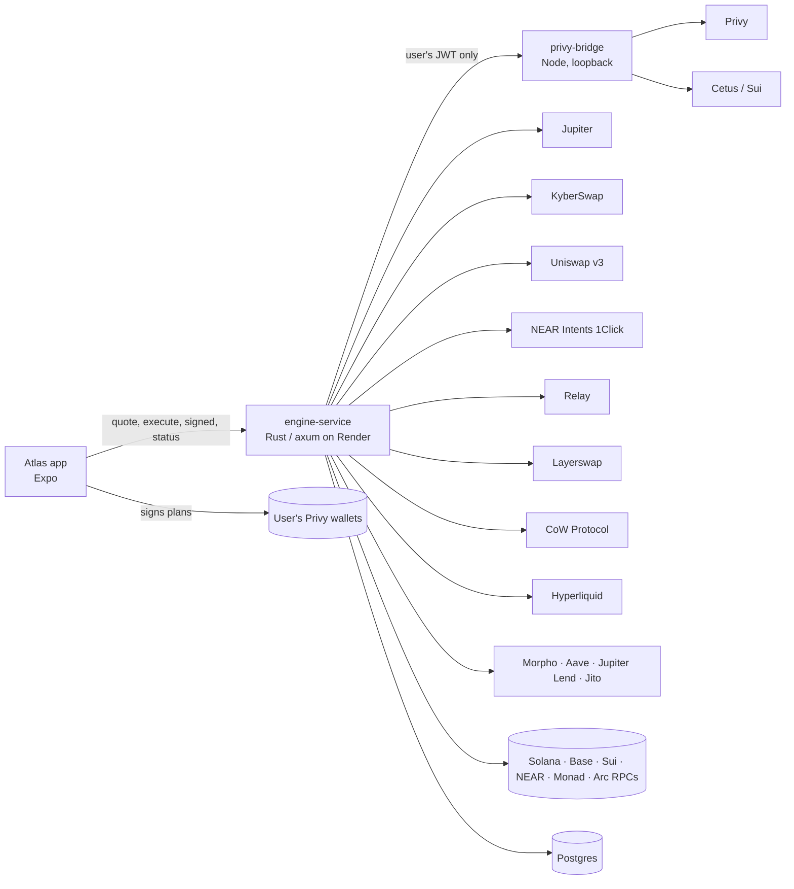

# Atlas Engine

**One balance, every chain, one tap.** Atlas gives people in Nigeria (and anywhere they're paid in a
currency that loses value) one balance in their own money that can buy memes, tokenized stocks and crypto,
open perps, earn yield and pay friends, across Solana, Base, Sui, Monad, NEAR and Arc. This repo is the
engine behind the [Atlas app](https://github.com/Iwetan77/Atlas): it prices everything, plans every action
as plain transactions for the user's **own** wallets, and settles them.

- **API:** https://atlas-engine-djed.onrender.com (`GET /health` shows the deployed commit and RPC hosts)
- **App:** [Iwetan77/Atlas](https://github.com/Iwetan77/Atlas) (Expo: iOS, Android, web)

Money is always shown in the user's currency (₦ first). Under the hood the cash is USDC on Solana and Base.
Chain names only appear where they protect the user: the deposit screen, where sending on the wrong
network loses money.

---

## How it works

1. **Sign in** with Google or email. Privy creates an embedded EVM wallet and a Solana wallet the user owns;
   the engine adds Sui and NEAR receiving wallets under the same login the first time they're needed.
2. **Add money.**
   - USDC on Solana or Base goes straight into the user's own wallet.
   - 23 more options (USDT on Tron and BNB Chain, USDC on Sui, SOL, BTC, ETH…) get a one-off deposit address
     from NEAR Intents 1Click; whatever arrives becomes USDC on Solana. The most used are flagged `featured`.
3. **One balance.** `GET /v1/balance` adds up cash on every chain, savings, perps margin and every coin held,
   valued live in the user's currency.
4. **Every action is a quote, then one confirm.**
   - The app asks for a quote; the engine prices it and checks limits and cash, in the user's currency.
   - On confirm it returns an **execution plan**: the exact transactions for the user's wallets, in order.
   - The app signs them after the one confirmation; the engine lands them and reports each stage:
     `validate → fund → sign → execute → settle`.
5. **Unified cash.** If the cash is on the other chain, the plan moves the shortfall first and finishes
   the action once it lands, still behind that one confirm:
   - Base → Solana through **Relay** (seconds, about 3 cents, no Base gas);
   - Solana → Base through **Layerswap** (with ETH for gas on the way when the wallet has none);
   - perps margin into **Hyperliquid** through Relay (gasless from Base, or one Solana transaction).
6. **Gas is never Atlas's.** The user pays from their own USDC, and Privy sponsorship is never used:
   - Solana: Jupiter pays on gasless swaps, otherwise a gasless $0.50 USDC → SOL top-up goes first.
   - Base: USDC leaving Base needs no ETH (one signed authorization; the venue's relayer pays). A wallet with
     no ETH first fills its tank with a gasless **CoW** order ($0.50 USDC → ETH, ~$0.004). With neither, the
     user is asked to add about $0.50.
7. **Atlas Links.** Money anyone can claim with a link. The sender's phone makes the link's secret (an EVM
   key) and only its escrow address reaches the engine; the plan funds the escrow on Base. The friend opens
   the link, signs in, and the bridge (given the secret they hold) signs one payout through Relay to their
   Solana wallet, with no gas. The sender can take it back the same way; after 30 days only the sender can.
8. **Track records.** Every spot fill is kept, so each holding shows its average entry and gain or loss;
   meme cards on Home are made from it.

---

## What's integrated

| | What it does in Atlas |
|---|---|
| **Privy** | Sign-in, the user's embedded wallets, and signing under the user's own login (JWT) for the few things only a server can do: relaying a Base transaction they confirmed, a gasless USDC authorization, a CoW top-up, a Sui swap. |
| **Jupiter** | Solana spot: ~350 verified assets (memes, xStocks, crypto), gasless orders, price charts, Jupiter Lend savings. |
| **KyberSwap** | Base swaps: searches every exchange for the best route (router pinned, every built swap decoded and checked: amount in, no fees, pays the user). Any Base token by pasting its address; trending Base coins (GeckoTerminal, CoinGecko-listed only) in Trade. |
| **Uniswap v3** | Base swaps when Kyber can't answer (one direct pool). |
| **NEAR Intents 1Click** | Buys on other chains (Sui, NEAR, Monad…), paid from Base cash or, when Base can't cover it, Solana cash; deposits from 23 networks and coins; SUI cashouts. |
| **Cetus** | Sui coins 1Click doesn't list (DEEP…): 1Click delivers SUI, then Cetus swaps it in the user's own Sui wallet. |
| **Relay** | Base → Solana cash moves (one EIP-3009 signature, the solver pays gas), and Atlas Link payouts. |
| **Layerswap** | Solana → Base (with refuel), the fallback to Relay. |
| **CoW Protocol** | The Base gas tank: a USDC permit plus a USDC → ETH order, settled by a solver who pays the gas. |
| **Hyperliquid** | Perps: ~290 markets (its own crypto perps plus the `xyz` dex's stocks, commodities, indices and currencies), margin moved in from the balance by Relay in the same confirm, open/close with one confirm, money back to cash after a close, candles for charts. The account is the user's own wallet; trades are signed by a per-user agent the user approves once (it can trade, never withdraw). |
| **Morpho, Aave, Jupiter Lend, Jito** | Earn: Morpho's three largest curated USDC vaults on Base (Gauntlet, Spark, Steakhouse), Aave USDC on Base, Jupiter Lend (USDC, USDT, JupUSD, USDS, EURC), SOL staking. Best rate first. |
| **GeckoTerminal, CoinGecko, DexScreener** | Charts for coins beyond Jupiter; the CoinGecko listing that marks a searched coin verified (exact contract, per chain); Sui search. |
| **Helius** | Solana RPC in production (any keyed RPC works). |
| **Render + Postgres** | Hosting; intents, trades, handles and photos survive restarts. |

---

## Safety model

Atlas never holds user funds, and the engine can't move a user's money anywhere they didn't confirm.

- **The user signs.** Plans are plain transactions for the user's own wallets; nothing leaves before their
  one confirmation, and the app never signs typed data itself.
- **Server-side signing is narrow and uses the user's own login.** The Privy bridge signs with the user's
  JWT, never an unrestricted server key, and only these shapes (`privy-bridge/base-authorization.mjs`), each
  rebuilt from checked fields and verified by recovering the signer:
  - a USDC `ReceiveWithAuthorization` from the user's wallet to a **pinned** receiver (Relay),
    for exactly the planned amount;
  - a USDC permit to CoW's vault relayer and a CoW order selling USDC for ETH **to the wallet itself**,
    both capped at $2 and two hours;
  - for an Atlas Link, a payout from the link's own escrow to Relay's pinned receiver, signed with the secret
    the claimer holds (the engine never stores it).
- **Venue answers are checked before anything is planned:** deposit contracts, receivers, amounts, chain IDs
  and minimum outputs. A quote that differs from what the user saw is refused.
- **Exact approvals**, never unlimited ones.
- **Retries never double an action.** Intents are claimed once (Postgres), stages only move forward, and a
  repeated report returns the current status.
- **Perps orders** are signed by the user's Hyperliquid agent: derived per user, approved once by the user's
  own wallet inside their first trade's confirm, able to trade and move margin between the user's own
  balances (Hyperliquid's own perps and the `xyz` stock dex), never withdraw or pay anyone else.
- **Perps money back to cash** after a close: the bridge asks Relay for the quote itself, with the user's own
  Solana (or Base) wallet as the recipient, checks every field of the two things the user's wallet signs (Relay's
  nonce mapping, a USDC `sendAsset` of exactly that amount to Relay's Hyperliquid account) and recovers the signer.
- **Unverified coins say so.** A coin found by search is verified only when CoinGecko lists that exact
  contract on its chain; look-alikes keep the warning.
- **Errors are honest:** in the user's currency, and when nothing moved, they say nothing moved.

---

## Architecture



```
crates/engine-service      The HTTP API: balance, markets, trades, perps, earn, friends, deposits, intents.
  src/markets.rs           Catalog, quotes, plans, unified cash, gas tanks, intent state machine.
  src/near_intents.rs      1Click buys, deposits, Sui/NEAR/Monad holdings, charts and verification.
  src/earn.rs              Morpho, Aave, Jupiter Lend, Jito.
  src/hl.rs                Hyperliquid perps: markets, positions, quotes, margin, orders, cash-out.
  src/gasless.rs           The user's session signs a checked authorization via the bridge.
  privy-bridge/            Node sidecar: Privy token checks and user-JWT signing (see Safety).
crates/engine-execution    Venue clients: jupiter, uniswap, near_intents, relay_link, layerswap, cow,
                           hyperliquid, solana, gateway.
crates/engine-core, engine-types, engine-discovery   Shared types and routing primitives.
```

**The engine in one breath:** a quote prices the action and checks cash across chains; execute turns it into
an intent with a plan (and, when cash or gas must move first, a funding step); `/signed` lands or relays what
the user signed; the status poll walks the intent through its stages, handing out the second step
(`/next`) once cash or gas has landed; fills are kept as trades for positions.

---

## API

All routes except `/health` need `Authorization: Bearer <Privy access token>`. Money in and out is in the
user's display currency.

| Method | Route | Purpose |
|---|---|---|
| GET | `/health` | Liveness, deployed commit, RPC hosts |
| GET | `/v1/balance?currency=` | The one balance and its holdings |
| GET | `/v1/assets?category=popular\|crypto\|stocks\|memes&q=` | Trade list (popular = trending) and search, incl. pasted addresses |
| GET | `/v1/assets/{id}/chart?range=1D\|1W\|1M\|1Y` | Price history (spot, 1Click coins and `*-PERP` markets) |
| POST | `/v1/quotes` → `/v1/quotes/{id}/execute` | Buy/sell quote, then its plan |
| GET | `/v1/positions/spot` | Entry, invested, value and gain/loss per holding |
| POST | `/v1/intents/{id}/signed` | What the app signed or sent for a plan |
| GET | `/v1/intents/{id}` | Where an intent stands |
| GET | `/v1/intents/{id}/next` | The second step, once cash or gas has landed |
| GET/POST | `/v1/perps/onboarding` | Perps access for the user's wallet |
| GET | `/v1/perps/markets`, `/v1/perps/positions` | Hyperliquid markets (crypto, stocks, commodities, indices, currencies) and open positions |
| POST | `/v1/perps/quotes` → `/execute`, `/v1/perps/positions/{id}/close-quote` → `/v1/perps/close-quotes/{id}/execute` | Open and close |
| GET | `/v1/earn/options`, `/v1/earn/positions` | Savings options and what's earning |
| POST | `/v1/earn/quotes` → `/v1/earn/quotes/{id}/execute` | Put in / take out |
| GET/POST | `/v1/me`, `/v1/me/handle`, `/v1/me/avatar`, `/v1/users/resolve` | Profile, @handles, photos |
| GET · POST | `/v1/cashlinks/{escrow}` (public) · `/v1/cashlinks/{escrow}/claim` | An Atlas Link, and claiming it |
| POST | `/v1/sends/quote` → `/v1/sends/quote/{id}/execute` | Send to a friend |
| GET | `/v1/deposit/networks` · POST `/v1/deposit/quote` · GET `/v1/deposit/status` | Deposits from other networks |

---

## Run it locally

You need Rust (stable) and Node 22+. Postgres is optional locally (intents stay in memory without it).

```bash
cargo build --workspace
(cd crates/engine-service/privy-bridge && npm ci)

# Without Privy (loopback only): a fixed test user and its wallets
ATLAS_DEMO_AUTH_BYPASS=1 ATLAS_TEST_USER_ID=did:privy:demo \
ATLAS_TEST_WALLET_ADDRESS=0x... ATLAS_SOLANA_OWNER_ADDRESS=... \
cargo run -p engine-service          # http://127.0.0.1:3000
```

### Configuration

| Variable | Needed for |
|---|---|
| `PRIVY_APP_ID`, `PRIVY_APP_SECRET` | The Privy bridge (server-side only) |
| `PRIVY_BRIDGE_URL` | Where the engine reaches the bridge (the Docker image sets it) |
| `DATABASE_URL` | Postgres: intents, trades, handles, avatars |
| `ATLAS_SOLANA_MAINNET_RPC_URL` | A keyed Solana RPC, e.g. `https://mainnet.helius-rpc.com/?api-key=…`. The public endpoint rate-limits. Stray quotes or spaces are forgiven; an invalid value falls back to the public endpoint (see `/health`) |
| `ATLAS_BASE_MAINNET_RPC_URL` | A keyed Base RPC (Alchemy, Coinbase Developer Platform…); public by default |
| `ATLAS_MONAD_MAINNET_RPC_URL`, `ATLAS_NEAR_MAINNET_RPC_URL`, `ATLAS_ARC_RPC_URL`, `SUI_FULLNODE_URL` | RPC overrides (public by default) |
| `JUPITER_API_KEY`, `NEAR_INTENTS_API_KEY`, `RELAY_API_KEY` | Optional venue keys (higher limits, lower 1Click fees) |
| `ATLAS_ALLOWED_ORIGINS` | CORS for the web app |
| `ATLAS_BALANCE_BIND` | Listen address (default `127.0.0.1:3000`) |

Never commit secrets; `.env*` files are ignored.

### Checks

Every change passes these before it's merged:

```bash
cargo build --workspace          # no warnings
cargo test --workspace
cargo fmt --all -- --check
git diff --check
(cd crates/engine-service/privy-bridge && node --test *.test.mjs)
```

Live checks against real venues are `#[ignore]` tests, run on demand:

```bash
cargo test -p engine-service live_ -- --ignored --nocapture
cargo test -p engine-execution live_ -- --ignored --nocapture   # Jupiter, Layerswap, Relay, CoW, Solana…
```

---

## Deploy

- **Render** builds the `Dockerfile` (Rust release build plus the Node bridge, which listens on loopback only)
  from the `swap-routing-base` branch; `main` mirrors it.
- Set the configuration above in Render's environment. `GET /health` returns the commit being served and the
  Solana/Base RPC hosts in use (never a key), so a wrong RPC setting shows up at once.

---

## What's been verified

Every ✅ has a live call or a reproducible check behind it.

| Check | Status |
|---|---|
| Jupiter catalog, quotes, gasless orders, charts; trending per kind | ✅ live |
| KyberSwap on Base: route and build decoded (router, amount, receiver, minimum); pasted Base tokens (DEGEN) priced both ways | ✅ live; ⏳ funded |
| Relay Base → Solana: exact-output quote, one EIP-3009 signature, fee ~$0.035 | ✅ live quotes; ⏳ funded move |
| CoW gas top-up: permit pre-hook and order signature accepted by CoW's orderbook | ✅ (a throwaway key fails only on balance) |
| Layerswap Solana → Base with refuel | ✅ live swaps created; ⏳ funded |
| Bridge signing shapes: USDC and CoW domain separators match chain; wider requests refused | ✅ unit tests |
| 1Click buys from Solana and Base cash (SUI, NEAR, MON), 23 deposit options | ✅ dry quotes; ⏳ funded |
| Cetus SUI → DEEP route and swap build | ✅ live route; ⏳ funded |
| Morpho vault rates and share values; Aave and Jupiter Lend rates | ✅ live |
| Charts for Sui/NEAR/Monad coins (GeckoTerminal); CoinGecko verification (DEEP, WAL verified) | ✅ live |
| Hyperliquid order and agent-approval signing (the live exchange recovered the exact signer) | ✅ live |
| Hyperliquid markets, account, candles; Relay into Hyperliquid from Base and Solana | ✅ live |
| Hyperliquid cash-out: Relay's nonce mapping accepted, `sendAsset` and `agentSendAsset` signers recovered | ✅ live (throwaway keys, no money) |
| Hyperliquid `xyz` dex: 110 markets, asset ids (110000 + index), per-dex accounts | ✅ live |
| Hyperliquid funded open and close | ⏳ needs a funded wallet |
| Atlas Links: payout quote from an escrow (0.5% room), escrow signing limited to Relay payouts | ✅ live quote + unit tests; ⏳ funded claim (needs the web app hosted) |
| Funded mainnet flows: buy, sell, send, earn in/out, perps open/close, deposits | ⏳ needs a funded wallet |

**Tests:** 82 Rust unit tests (engine-execution and engine-service) and 16 bridge tests, plus the live
checks above.


### Phone approvals and waiting purchases

The engine prepares signing requests; access tokens authenticate their owner and never authorize a wallet signature.
Plans may include `{ "chain": "privy", "request": { "version": 1, "method": "POST", "url": "...", "body": { "params": {} }, "headers": {} } }` for Sui/NEAR.
The phone approves the exact request with Privy's authorization-signature hook. EVM plans may include
`{ "chain": "base", "typedData": { "domain": {}, "types": {}, "primaryType": "...", "message": {} } }`
or `chain: "hyperliquid"`. The embedded wallet signs EIP-712 locally. Both types are returned as
`{ "index": 0, "transaction": "signature" }` in `/v1/intents/{id}/signed`, never sent as an EVM transaction.

After a deposit arrives, `stage: "sign"` means the phone must approve the next step from
`GET /v1/intents/{id}/next`. The current action keeps its single confirmation. Prepared requests expire within three
minutes and are consumed once; expired preparations must be fetched again, not replayed.

`GET /v1/intents/pending` (Bearer auth) returns `{ "intents": [{ "intentId", "symbol", "kind", "stage", "error" }] }`.
It only returns the caller's waiting steps, including received funds from a safely failed purchase.
`POST /v1/intents/{id}/resume {}` returns a fresh ExecutionPlan for those funds, with optional `stage: "sign"`.
Home shows a Finish card and reviews this plan without collecting a new purchase payment.
NEAR batches approve each transaction, use consecutive nonces, submit in order and report hashes for any completed
steps if a later send cannot be verified. Unknown outcomes are not retried as fresh payments.

Read-only mainnet checks: run `device-approval.live.mjs` from `privy-bridge` with `ATLAS_DRY_USER_ID` and the ignored
Privy environment file. The script refuses signing, broadcasting and exchange writes. An unfunded receiving wallet
cannot build a transaction until it holds its input and gas; report those checks as unverified, not passed.

### Asset search completeness

`GET /v1/assets?currency=NGN&category=crypto&q=deep` keeps the existing `{assets:[...]}` shape and adds `searchComplete: boolean`. Sui, Ref and 1Click lookups run independently; one provider's timeout never discards another provider's rows. Prices and on-chain metadata remain required. Verification badges refresh in the background and stay unverified until the exact contract is known.

When `searchComplete` is false, the app keeps any returned rows and offers a retry. An empty incomplete search is retried once, then shown as a failed lookup, never as a confirmed no-match. A completed empty search may show no matches.
